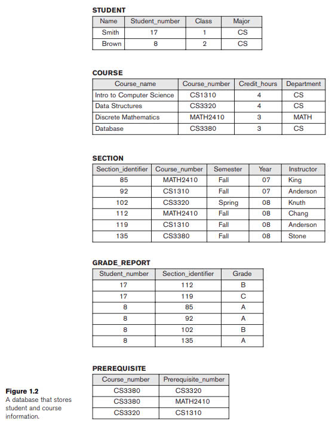

# CHAPTER 1: DATABASES AND DATABASE USERS 

- everyday we interact with databases (i.e making a transaction, purchase something online,...) $\rightarrow$ **traditional database applications** (most of the information stored and accessed is either textual or numeric)
- nowadays we have **multimedia databases** (can store images, audio clips, video streams digitally)
- **Geographic information systems (GIS)** (maps, weather, satelite images,...)
- **Data Warehouse** and **online analytical processing (OLAP)** systems are used to extract and analyze information from large databases
- **Real-time** and **active database technology** is used to control industrial manufacaturing processes 

### Definitions

| TERMS                             | DEFINITIONS                                                                                                  |
|-----------------------------------|------------------------------------------------------------------------------------------------------------------------------|
| database                          | collection of related data
| data                              | facts that can be recorded and have meaning                                                                                  |
| database management system (DBMS) | collection of programs that enables users to create and maintain a database  (defining, constructing, manipulating, sharing) |
| defining a database               | specifying the data types, structure, constraints of the data                                                                |
| meta-data                         | database definition, stored by the DBMS in the form of a database catalog                                                    |
| constructing a database           | the process of storing the data on some storage that is controlled by the DBMS                                               |
| manipulating the database         | functions to retrieve data, update the database, generate reports from the data                                              |
| sharing a database                | allows multiple users and programs to access the database simultaneously                                                     |
| query                             | causes some data to be retrieved                                                                                             |
| transaction                       | cause some data to be read                                                                                                   |
| protection                        | includes system protection (against crashes) & security protection (against malicious access)                                |
| maintain a database               | allow the system to evolve as requirements change overtime                                                                   |

- a database has the following implicit properties
  - it represents some aspect of the real world (called **miniworld** or **universe of discourse (UoD)**)
  - it's a logical coherent collection of data
  - it's designed, built, and populated with data for a specific purpose
- an **application programs** accesses the database by sending requests or queries for data to the DBMS

### An Example: University database

- **_Defining the database_**: specify the different types of **data elements** to be stored in each record
  - `STUDENT` record includes `Name` (string), `Student_number` (integer), `Class` (1, 2, 3, 4, 5), `Major` (`MATH`, `CS`)
  - `COURSE` record include `Course_name`, `Course_number`, `Credit_hours`, and `Department`

- **_Construct the database_**: store data to represent each student, course, selection, grade repost, and prerequisite as a record in the appropriate file
- **_Manipulating tha database_**: involves querying and updating
  - retrieve the transcript (query)
  - list the names of the students who took the `Database` course (query)
  - change the class of `Smith` to sophomore (update)
  - create a new section for the `Database` course for this semester (update)

> **_IRL_**
> - _the database is a part of the information system within any organization_
> - _the IT department of a company designs and maintains an information system consisting of various computers, storage systems, application softwares, and databases_
> - _Design of a new application for an existing database or design of a brand new database starts off with a phase called **requirements specification and analysis**_
> - _These requirements are documented in detail and transformed into a **conceptual design** (we'll look at the _Entity-Relationship_ model later)_
> - _The design is then translated to a **logical design** that can be expressed in a data model implemented in a commercial DBMS (_Relational Data Model_)_
> - _The final stage is **physical design**, during which further specifications are provided for storing and accessing the database. The database design is implemented, populated with actual data, and continuously maintained to reflect the state of the miniworld_

### Main Characteristics of database systems (vs file processing)

- **file processing**: an older approach of programming with files

| CHARACTERISTICS                                            | FILE PROCESSING                                                                                                                                            | DATABASE                                                                                                                                                                                                                                                                    |
|------------------------------------------------------------|------------------------------------------------------------------------------------------------------------------------------------------------------------|-----------------------------------------------------------------------------------------------------------------------------------------------------------------------------------------------------------------------------------------------------------------------------|
| self-describing nature of a database system                | - data definition is typically part of the application programs themselves   - these programs are constrained to work with only one specific database  | - the **database** also contains definitions of the database structure and constraints (**meta-data**)   - a general-purpose DBMS software package can work well with any number of database applications, as long as the database definition is stored in the database |
| insulation between programs and data, and data abstraction | - any changes to the structure of a file may require changing all programs that access that file                                                           | - we only need to change the description of the file in the catalog (**program-data independence**)                                                                                                                                                                         |
| support of multiple views of the data                      | - consists of direct access to data files                                                                                                                  | - has many users, each of whom may require a different **view** of the database                                                                                                                                                                                             |
| sharing of data and multiuser transaction processing       | - lack of concurrency control   - is intended for personal use (i.e File Manager system on Window)                                                     | - allow multiple users to access the database at the same time   - must include **concurrency control** software to ensure that several users trying to update the same data do so in a controlled manner                                                               |

- **view** of a database: maybe a subset of the database, or **virtual data** that is derived from the database files but not explicitly stored 

- an **operation**: has 2 parts
  1. the **interface (signature)** = operation name + parameters
  2. the **implementation (methods)**: is specified separately and can be changed without affecting the interface
  - user application programs can operate on the data by invoking these operations through their names and arguments, regardless of how the operations are implemented $\rightarrow$ **program-operation independence**
  - in some types of database systems, users can define operations on data
- the characteristic that allows program-data independence and program-operation independence is called **data abstraction**
- a DBMS provides users with a **conceptual representation** of data that does not include how the data is stored or how the operations are implemented
- **data model**: is a type of data abstraction used to provide this conceptual representation (easier for users to understand and use)
- in object-oriented and object-relational databases, the abstraction process includes not only the data structure but also the operations on the data $\rightarrow$ **abstract operation**

- **transaction**: an executin program or process tat includes one or more database accesses 
- **online transaction processing (OLTLP)** applications: ex. when several teenagers're booking tickers for a movie
- transaction properties
  1. **isolation**: ensures that each transaction appears to execute in isolation from other transactions 
  2. **atomicity**: ensures that either all the database operations in a transaction are executed or none are 

### Roles around database systems

- **actors**: those who use the database
  - **_Database Administrators (DBA)_**: is responsible for authorizing access to the database, coordinating and monitoring its use, and acquiring software and hardware resources as needed 
  - **_Database Designers_**: are responsible for identifying the data to be stored in the database and for choosing appropriate structures to represent and store this data
  - **_End Users_**: people whose jobs require access to the database for querying, updating, and generating reports; the database primarily exists for their use (you can look up types of end users in the book at page 45) 
  - **_Software Engineers_** = **_System Analysts_** and **_Application Programmers_**
    - **_System Analysts_**: determine the requirements of end users, especially naive and parametric end users, and develop specifications for standard canned transactions that meet these requirements
    - **_Application programmers_**: implement these specifications as programs; then they test, debug, document, and maintain these canned transactions
- **workers**: those who work to maintain the database system but are not interested in the database content
  - **_DBMS system designers and implementers_**: design and implement the DBMS modules and interfaces as a software package (A DBMS is a very complex software system that consists of many components - **modules**)
  - **_Tool developers_**: design and implement **tools** (the software packages that facilitate database modeling and design, database system design, and improved performance, are optional packages that are often purchased separately)
  - **_Operators and maintainance personnel_**: responsible for the actual running and maintenance of the hardware and software environment for the database system

### Advantages of using the database approach 

1. **_controlling redundacy_** (on a scale, not avoid it complety)
    - each logical item (i.e student's name) is stored in only one place $\rightarrow$ **data normalization** $\rightarrow$ **avoid redundancy**
    - placing all the data together to avoid searching for multiple flies to collect a specific data $\rightarrow$ **denormalization** $\rightarrow$ **controlled redundancy**
    - the DBMS should have the capability to control this redundancy

2. **_restricting unauthorized access_**
    - a DBMS should provide a **security and authorization subsystem** (where only some chosen individual can perform certain actions on the database using **privileged software**)

3. **_providing persistent storage for program objects_**
    - an object in the database is **persistent** if it survives the termination of programs execution and can later be directly retrieved by another program
    - traditional database systems often suffered from **impedance mismatch problem**, since the the data structures provided by the DBMS were incompatible with the programming language’s data structures
    - **Object-oriented database systems** typically offer data structure **compatibility(( with
    one or more object-oriented programming languages

4. **_providing storge structures and search techniques for efficient query processing_**
    - as data is typically stored on disk, the DBMS must provide capabilities for efficiently executing queries and updates
    - **indexes**: are auxiliary files used for this purpose (disk search, based on tree | hash data structures)
    - records are copied from disk to main memory for queries $\rightarrow$ the DBMS oftern has **buffering** or **caching** module that maintains parts of the database in main memory buffers
    - the **query processing and optimization** module: responsible for choosing an efficient query execution plan for each query based on the existing storage structures

> **_IRL_**
> _- The choice of which indexes to create and maintain is part of physical database design and tuning, which is one of the responsibilities of the DBA staff_

5. **_providing backup and recovery_**
    - the **backup and recovery subsystem**: is responsible for recovery

6. **_providing multiple user interfaces_**
    - a DBMS should provide a variety of user interfaces for the many types of users with varying levels of technical knowledge 
    - **graphical user interfaces (GUIs)**: forms-style interfaces & menu-driven interfaces 

7. **_representing complex relationships among data_**
    - define new relationships as they arise
    - retrieve and updadte related data easily and efficiently

8. **_enforcing integrity constraints_**
    - most database applications have certain **ingerity contraints** that must hold for the data
    - **referential integrity** constraint (i.e every section record must be related to a course record)
    - **key | uniqueness** constraint: specifies uniqueness on data items values

9. **_Permitting inferencing and actions using rules_**
    - **deductive database systems**: provide capabilities for defining **deduction rules** for inferencing new information from the stored database facts (i.e the database can automatically detect whether a student is on probation and generate that data)
    - **trigger** (with tables): a form of a rule activated by updates to the table, which result in some operations peformed to other tables
    - **stored procedures**: more involved procedures to enforce rules
    - the database systems that have more powerfil functionality are called **active database systems**

10. _(there are more in the book at section 1.6.10 at page 51)_

### A brief history of database applications (_read more at page 52 of the book_)

### When not to Use a DBMS 
- there are a few situations in which a DBMS may involve unnecessary overhead costs that would not be incurred in tradiontional file-processing
- the overhead costs are due to:
  - high initial investment in hardware, software, and training
  - the generality that a DBMS provides for defining and processing data
  - overhead for providing security, concurrency control, recovery, and integrity functions
- therefore, it's better to use regular file in the following cases
  - simple, well-defined database applications that are not expected to change at all
  - stringent, real-time requirements for some application programs that may not be met because of DBMS overhead
  - embedded systems with limited storage capacity, where a general-purpose DBMS would not fit
  - no multiple-user access to data 

### Summarization 

In summary, chapter 1 contains
- the definitions of database and its related components
- an simple example of a database
- the database approach vs. the file processing approach
- types of people who involves with a database
- advantages and disadvantages of using the database approach 

### Linkies 

- I read mostly from the book
- I use [this](https://www.tablesgenerator.com/markdown_tables#google_vignette) to generate md tables
- [reference1](https://www.dremio.com/wiki/file-processing-system/#:~:text=File%20Processing%20Systems%20offer%20direct,and%20file%2Dlevel%20data%20manipulation.) on file processing systems
- [reference2](https://www.geeksforgeeks.org/file-processing-system-fps/) on file processing systems

### questions

- [ ] does an _object_ in line 108 refers to a field in a table in a database?
- [ ] what does _semantic of the data_ means?
- [ ] explore the career path of database systems? What skills are required? Is it a hot career path in Viet Nam?
