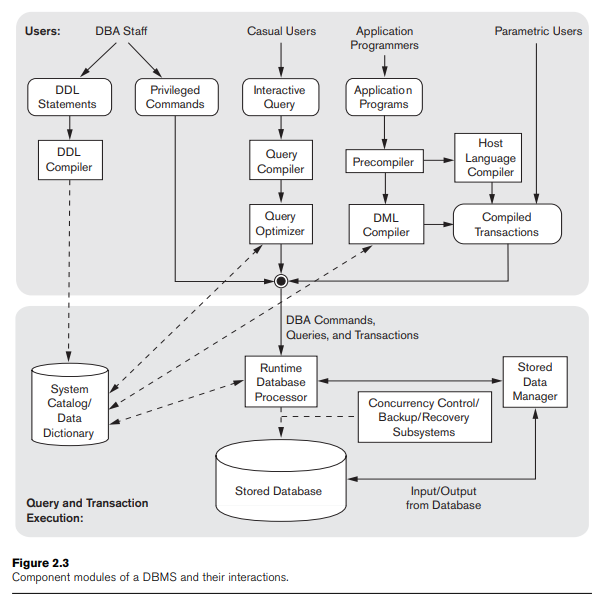
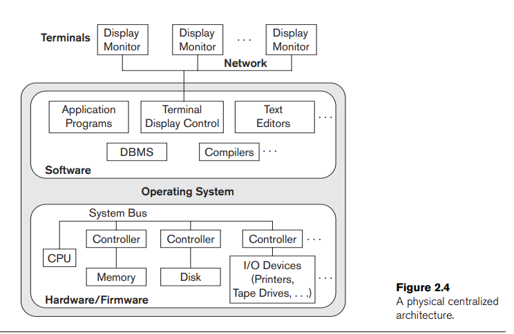
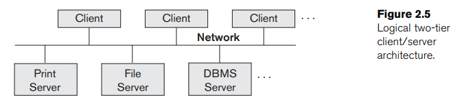
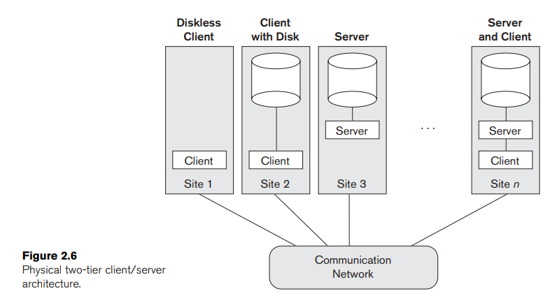
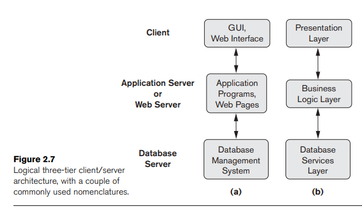

# CHAPTER 2. DATABASE SYSTEM CONCEPTS AND ARCHITECTURE 

### Introduction 

- the architecture of DBMS pakages has evolved from a tightly integrated system, to packages that are modular in design, with a client/server system architecture

### Data Models, Schemas, and Instances

- **data abstraction**: the suppression of details of data organization and storage, and highlighting of the essential features for an improved understanding of data
- **data model**: a collection of concepts that is used to describe the structure of a database (provides the means to achieve **data abstraction**)
  - _structure of a database_: data types, relationships, and constraints apply to the data
  - most data models also include a set of **basic operations** for specifying retrievals and updates on the database (insert, delete, modify,...)
  - **dynamic aspect** of a database application, for the database designer to specify valid user-defined operations 
- categories of data models - for each type of user, ranging from parametric users (most users) to computer specialists (who build the database)
  - **high-level** or **conceptual data models** provide concepts that are close to the way many users perceive data $\rightarrow$ **Entit-Relationship model**
    - **entity**: a real-world object or concepts (ex. an employee)
    - **attribute**: a property of interest that further describe an entity
    - **relationship**: an association among the entities
    - **object data model**: an example of a new family implementation data models that are closer to conceptual data models
- **low-level** or **physical data models** describe the detail of how data is stored on the computer storage media, typically magnetic disks
  - **access path**: a structure that makes the search for particular database recordss efficient
  - **index**: an example of an access path that allows direct access to data using an index term or keyword
- **representational data models** provide concepts that can be understood by end users but are not too far from the way data is organized in computer storage
- **database schema** or **intension**: the description of the data (different from the _database itself_)
- **schema diagram**: a displayed schema
- we call each object in the schema, such as `STUDENT` or `COURSE` a **schema construct**

- **database state** or **snapshot** or **extension** (of the schema): the data in the database at a particular moment in time / the current set of **occurences** or **instances** in the database
- _the schema is not supposed to change frequently_

### Three-Schema Architecture and Data Independence

- **three-schema architecture**: an architect for database systems, for achieving the following characteristics (listed in section 1.3)
  - use of a catalog to store the database description (schema)
  - insulation of programs and data (program-data and program-operation independence)
  - support of multiple user views
- the architecture clearly separates the users’ external level, the database’s conceptual level, and the internal storage level for designing a database
- _the three schemas are only descriptions of data, the stored data that actually exists is at the physical level only_
- in a DBMS based on the three-schema architecture, each user group refers to its own external schema. Hence, the DBMS must transform a request specified on an external schema into a request against the conceptual schema, and then into a request on the internal schema for processing over the stored database $\rightarrow$ The processes of transforming requests and results between levels are called **mappings**
  - whenever we have a multiple-level DBMS, its catalog must be expanded to include
  information on **how to map requests and data among the various levels**

- **data independence**: the capacity to change the schema at one level of a database system without having to change the schema at the next higher level
- there are 2 types of data independence
  1. **logical data independence**: the capacity to change the conceptual schema without having to change external schemas or application programs
  2. **physical data independence**: the capacity to change the internal schema without having to change the conceptual schema
- Data independence occurs because when the schema is changed at some level, the schema at the next higher level remains unchanged; only the mapping between the two levels is changed

### Database Languages and Interfaces

#### Languages

- **data definition language (DDL)** is used by the DBA and by database designers to define both schemas (internal and conceptual schemas)
- **storage definition language (SDL)** is used to specify the internal schema (in DBMSs where a clear separation is maintained between the conceptual and internal level)
  - _In most relational DBMSs today, there is no specific language that performs the role of SDL. Instead, the internal schema is specified by a combination of functions, parameters, and specifications related to storage_
- **view definition language (VDL)**: specify user views and their mappings to the conceptual schema (for a true three-schema architecture)
- **data manipulation language (DML)**: a language for users to manipulate the database, there are 2 types
  - **high-level** or **non-procedural** or **set-at-a-time** or **set-oriented**: many DBMSs allow high-level DML statements either to be entered interactively from a display monitor or terminal or to be embedded in a general-purpose programming language
  - **low-level** or **procedural** or **record-at-a-time**: must be embedded in a general-purpose programming language
- Whenever DML commands, whether high level or low level, are embedded in a general-purpose programming language, that language is called the **host language** and the DML is called the **data sublanguage**
- a high-level DML used in a standalone interactive manner is called a **query language**
- _In current DBMSs, the preceding types of languages are usually not considered distinct languages; rather, a comprehensive integrated language is used that includes constructs for conceptual schema definition, view definition, and data manipulation_
-  _For naive and parametric users, there usually are **user-friendly interfaces** for interacting with the database_

#### Interfaces 

- User-friendly interfaces provided by a DBMS may include the following:
- Menu-Based Interfaces for Web Clients or Browsing
  - user can choost from lists of options (called menus) that lead the user through the formulation of a request
- Forms-Based Interfaces
  - Users can fill out all of the form entries to insert new data, or they can fill out only certain entries, in which case the DBMS will retrieve matching data for the remaining entries
- Graphical User Interfaces
  - displays a schema to the user in diagrammatic form
  - the user then can specify a query by manipulating the diagram
- Natural Language Interfaces
  - these interfaces accept requests written in English or some other language
  - example: search engines like Google or Ask 
- Speech Input and Output
  - applications with limited vocabularies such as inquiries for telephone directory, flight arrival/departure, and credit card account information are allowing speech for input and output to enable customers to access this information
- Interfaces for parametric users
  - since arametric users, such as bank tellers, often have a small set of operations that they must perform repeatedly, usually only a small set of abbreviated commands is included, with the goal of minimizing the number of keystrokes required for each request
  - example: function keys in a terminal can be programmed to initiate various commands
- Interfaces for the DBA
  - most database systems contain privileged commands that can be used only by the DBA staff
  - example: creating accounts, setting system parameters, granting account authorization, changing a schema, and reorganizing the storage structures of a database

### The Database System Environment

- the types of software components that constitute a DBMS
- the types of computer system software with which the DBMS interacts

- #### DBMS Component Modules

- **OS - operating system**: schedules disk read/write
- **buffer management**: Many DBMSs have their own module to schedule disk read/write
- **stored data manager module**: controls access to DBMS information that is stored on disk, whether it is part of the database or the catalog
- **interactive query**: a form of interface for casual users and persons with occasional need for information from the database
  - these queries are parsed and validated by a **query compiler** that compiles them into an internal form
  - the **query optimizer** is concerned with the rearrangement and possible reordering of operations, elimination of redundancies, and use of correct algorithms and indexes during execution
- Application programmers write programs in host languages such as Java, C, or C++ that are submitted to a precompiler
  - **Precompiler**: a special tool called a "precompiler" looks at this program and separates out the database commands from the rest of the code
  - **Compilation**: the database commands are sent to a DML compiler to turn them into instructions that the database understands. Meanwhile, the rest of the program is compiled by the normal language compiler
  - **Linking**: After compiling, the two parts (database commands and the rest of the program) are joined together into a complete program, called a "canned transaction.
  - **Execution**: This canned transaction can be run over and over. Users can provide specific values, like an account number and withdrawal amount in a bank system, each time the transaction is executed. Each run is treated as a separate transaction
- **Runtime Database Processor**: This component is responsible for executing various types of commands like:
  - **Privileged commands**: Special commands that only certain users, like database administrators (DBA), can run.
  - **Executable query plans**: Queries from users that are compiled into efficient execution plans.
  - **Canned transactions**: Predefined transactions that users run repeatedly, providing parameters like account numbers and amounts.
- **Interaction with the System Catalog**: While executing, the runtime database processor also uses a **System Catalog** (a kind of data dictionary) to get information about the structure and status of the database. It may also update this catalog with statistics like how often data is accessed
- **Stored Data Manager**: handles the low-level task of reading from and writing to the database (disk storage). The data manager uses services from the operating system for these input/output (I/O) tasks
- **Memory Management**: The runtime processor also manages buffers—temporary areas in main memory—where it stores data temporarily as it's being read or written to disk
- **Concurrency Control and Recovery**: These systems ensure that multiple users can safely interact with the database at the same time (concurrency control) and that the database can recover from failures (backup and recovery). Though they are shown as separate in the figure, they work closely with the runtime database processor for managing transactions.
- **Client-Server Architecture**: Nowadays, it’s common for the **client** (the user’s program) and the **database server** (where the database resides) to be on different computers. Sometimes there is also an application server in between, which handles additional logic before interacting with the database server

#### Database System Utilities

- **Loading**:  is used to load existing data files—such as text files or sequential files—into the database
  - Some vendors are offering products that generate the appropriate loading programs, given the existing source and target database storage descriptions (internal schemas). Such tools are also called **conversion tools**
- **Backup**: a backup utility creates a backup copy of the database, usually by dumping the entire database onto tape or other mass storage medium
- **Database storage reorganization**: this utility can be used to reorganize a set of database files into different file organizations, and create new access paths to improve performance
- **Performance monitoring**: such a utility monitors database usage and provides statistics to the DBA

#### Tools, Application Environments, and Communications Facilities

1. CASE Tools
  - **Purpose**: Software tools used during the design phase of database systems.
  - **Usage**: They assist database designers by simplifying the planning and design process.

2. Data Dictionary/Repository
  - **Data Dictionary**: A system that stores important metadata about the database such as:
    - **Schemas and Constraints**: Technical details about the structure and rules of the database.
    - **Design Decisions**: Information about why certain structures or technologies were chosen.
    - **Application Program Descriptions and User Information**: Helps document the applications and user roles.
  - **Access**: Used by both DBAs and users to retrieve information about the database.
  - **Also Known As**: An information repository, offering more comprehensive data compared to a typical DBMS catalog.

3. Application Development Environments
  - **Popular Tools**: Examples include **PowerBuilder (Sybase)** and **JBuilder (Borland)**.
  - **Features**:
    - Help with **database design**, **GUI development**, **querying/updating**, and **application program development**.
    - Provide a convenient environment for developing database-driven applications.

4. Communications Software
  - **Purpose**: Allows users to access the database remotely.
  - **How It Works**:
    - Users can connect via terminals, workstations, or personal computers.
    - Uses data communication hardware like **Internet routers**, **phone lines**, **LANs**, or **satellites**.
    - Many commercial DBMS come with communication packages to integrate these systems.
  - **DB/DC System**: A combined system of a DBMS and data communication software.

5. Distributed DBMS
  - **Definition**: A DBMS that is spread across multiple machines.
  - **Communication Networks**: Typically connected via **local area networks (LANs)** or other network types.
  - **Purpose**: Allows multiple systems to work together, ensuring smooth operation across different physical locations.

### Centralized and Client/Server Architectures for DBMSs

#### Centralized BDMSs Architecture

- **Early Systems**: Used mainframe computers to handle all processing (DBMS functions, application execution, user interface).
- **Terminals**: Users accessed the system via simple terminals that only displayed information, with all processing done remotely on the central computer.
- **Hardware Evolution**: As hardware became cheaper, terminals were replaced by PCs and workstations.
- **Initial Use**: PCs were initially used like terminals, with the DBMS still performing all tasks on one central machine.
- **Transition to Client/Server**: Eventually, DBMSs started using the processing power of user devices, shifting to a **client/server architecture** where tasks were distributed.

#### Basic Client / Server Architecture 

_Overview_
  - **Client/Server Architecture**: Connects multiple devices (PCs, workstations, servers) over a network to share resources.
  - **Specialized Servers**:
    - **File Servers**: Manage files for client machines.
    - **Printer Servers**: Handle printing requests from multiple clients.
    - **Web and Email Servers**: Provide specialized services accessible to many clients.

_Client Machines_
  - **Role**: 
    - Clients access servers for services like printing, file storage, or database access.
    - Handle local processing and run user applications.

_Physical Architecture_
  - **Diskless Clients**: Machines without local disks that rely entirely on servers for data.
  - **Clients with Disk**: Machines with local storage but that still connect to servers for certain functions.
  - **Servers**: Dedicated machines for specific services like file storage or databases.
  - **Server and Client**: Some machines can function as both, offering services and accessing others.

_Underlying Framework_
  - **Clients**: User machines with interfaces and local processing.
  - **Servers**: Systems (both hardware and software) that provide services to clients (file access, printing, database access, etc.).
  
_DBMS Architectures_
  - **Two-Tier and Three-Tier**: Based on the client/server framework, there are two main DBMS architecture types:
    - **Two-Tier**: Client connects directly to the database server.
    - **Three-Tier**: Adds an intermediate layer (application server) between the client and the database server.

#### Two-Tier Client / Server Architectures for DBMS

- **Two-Tier Architecture**: Software components are split between the client and server.
  - **Client Side**: Runs user interfaces and application programs.
  - **Server Side**: Handles SQL queries and transaction processing, often called an **SQL server**.

- **How it Works**:
  - The client connects to the DBMS on the server to access the database.
  - Standards like **ODBC** (for general programs) and **JDBC** (for Java programs) allow clients to interact with DBMSs across multiple platforms using standard interfaces.
  - The client sends queries, which are processed on the server, and results are returned to the client for display or further processing.

- **Object-Oriented DBMS Variation**:
  - Some object-oriented DBMSs split tasks more evenly between the client and server.
  - Server handles tasks like data storage and recovery, while the client manages tasks like structuring data into objects and interacting with the user interface.

- **Advantages**:
  - Simple architecture and easy compatibility with existing systems.

- **Evolution**:
  - The Web introduced the **three-tier architecture**, where an additional layer (application server) sits between the client and database server.

#### Three-Tier and n-Tier Architectures for Web Applications 

_Overview_
  - **Three Tiers**: This architecture introduces an intermediate layer between the client and the database server, making it more efficient and secure.
    1. **Client (Presentation Layer)**: Handles the user interface (e.g., GUI or web interface). The client can apply some business rules.
    2. **Application Server (Business Logic Layer)**: This middle layer handles application programs and business rules, processes requests from the client, and sends commands to the database server.
    3. **Database Server (Data Layer)**: Manages the database, handles queries, and stores data.
   
  

_Functionality_
  - **Application Server Role**:
    - Acts as an intermediary between the client and the database server.
    - Runs business rules, checks client credentials, and forwards secure requests to the database server.
    - Passes processed data from the database server back to the client for further processing or display.

- **Security**: The application server enhances security by verifying client credentials before accessing the database.
  
- **Web Applications**: The middle layer often serves as a **Web Server**, retrieving data from the database and formatting it into web pages for clients.

_Variations_
  - **N-Tier Architecture**: This model can be expanded into 4 or 5 tiers, where the business logic is split into more layers. It allows flexibility as each layer can run on different platforms.
    
  - **ERP/CRM**: Systems like ERP (Enterprise Resource Planning) and CRM (Customer Relationship Management) use a middle layer (middleware) to connect clients to multiple back-end databases.

_Data Security and Efficiency_
  - **Encryption**: Sensitive data is transferred securely using encryption.
  - **Data Compression**: Technologies like data compression improve the transfer of large data over networks.

### Classification of Database Management Systems

1. **Data Model**:
   - **Relational Model**: Most common in current DBMSs (e.g., SQL-based systems).
   - **Object Model**: Used less frequently but found in some commercial systems.
   - **Object-Relational**: A hybrid model combining relational and object concepts.
   - **Legacy Models**: Includes **Hierarchical** (e.g., IMS, System 2K) and **Network Models** (e.g., IDMS, SUPRA).
   - **XML Model**: A newer model based on XML, used for web applications and data exchange.

2. **Number of Users**:
   - **Single-User**: Typically used on personal computers (PCs).
   - **Multi-User**: Supports multiple users concurrently (majority of DBMSs).

3. **Number of Sites**:
   - **Centralized DBMS**: Data is stored and managed at a single site.
   - **Distributed DBMS (DDBMS)**:
     - **Homogeneous**: Uses the same DBMS software at all sites.
     - **Heterogeneous**: Uses different DBMS software at different sites.

4. **Cost**:
   - **Open Source**: Free DBMSs like MySQL and PostgreSQL.
   - **Commercial Systems**: RDBMS vendors offer both free trials and full versions, with varying costs based on features and usage.

5. **Access Path Options**:
   - **Inverted File Structures**: DBMSs that use this file structure for faster data access.

6. **Purpose**:
   - **General Purpose**: Can be used for various applications.
   - **Special Purpose**: Tailored for specific applications (e.g., airline reservations, telephone directories).

**Legacy Data Models**:
   - **Network Model**:
     - Uses record types and set types with commands like `FIND` and `GET`.
     - Examples: IDMS, IMAGE, SUPRA.
   - **Hierarchical Model**:
     - Represents data in tree structures.
     - Dominated by IMS with its DML called DL/1, widely used in industries like healthcare and banking.

**Modern DBMS Trends**:
   - Relational DBMSs are adopting object-oriented features, leading to **Object-Relational DBMSs**.
   - **XML DBMS**: Based on XML for data exchange and hierarchical structures, used in web-based applications.

### Summary 

1. **Data Models**:
  - **High-level (Conceptual)**: Focus on entities and relationships.
  - **Low-level (Physical)**: Describes how data is stored.
  - **Representational (Implementation)**: Includes record-based and object-oriented models.

2. **Schema vs. Database**:
  - **Schema**: Describes the structure of the database; changes infrequently.
  - **Database State**: Changes with every data insertion, deletion, or modification.

3. **Three-Schema Architecture**:
  - **Internal Schema**: Describes physical storage.
  - **Conceptual Schema**: High-level description of the entire database.
  - **External Schema**: Describes user-specific views of the database.

4. **DBMS Languages**:
  - **Data Definition Language (DDL)**: Defines schemas (conceptual, user views, and storage structures).
    - **SQL**: Serves as a universal language for schema definition, query execution, and more.
  - **Data Manipulation Language (DML)**: Used for retrieving and updating data.
    - **High-level DML**: Set-oriented, nonprocedural.
    - **Low-level DML**: Record-oriented, procedural.

5. **DBMS Interfaces & Users**:
  - Various types of interfaces are available depending on the users (end-users, DBAs, etc.).

6. **DBMS Architectures**:
  - **Two-tier Architecture**: Client interacts directly with the database server.
  - **Three-tier Architecture**: Introduces an intermediate application server between the client and database server.
  - **N-tier Architecture**: Expands further, often used in web applications.

7. **DBMS Classification**:
  - Based on:
    - **Data Model**: Relational, object-oriented, etc.
    - **Number of Users**: Single-user or multi-user.
    - **Number of Sites**: Centralized or distributed.
    - **Access Paths**: Methods of storing and retrieving data.
    - **Cost**: From free open-source systems to costly enterprise solutions.

8. **Logical and Physical Data Independence**:
  - The three-schema architecture supports **data independence**, allowing separation between the logical view and physical storage of the data.
    - **Logical Independence**: Changing the conceptual schema without affecting external schemas.
    - **Physical Independence**: Changing the internal schema without affecting the conceptual schema.

**_Conclusion_**: DBMSs have evolved to support complex environments with multiple users and sites. They incorporate multiple levels of abstraction (internal, conceptual, external) and offer various ways to define, manipulate, and retrieve data.

### Review questions

- Define the following terms:
  - data model
  - database schema
  - database state
  - internal schema
  - conceptual schema
  - external schema
  - data independence
  - DDL
  - DML
  - SDL
  - VDL
  - query language
  - host language
  - data sublanguage
  - database utility
  - catalog
  - client/server architecture
  - three-tier architecture
  - n-tier architecture
- Discuss the main categories of data models. What are the basic differences between the relational model, the object model, and the XML model?
- What is the difference between a database schema and a database state?
- Describe the three-schema architecture. Why do we need mappings between schema levels? How do different schema definition languages support this architecture?
- What is the difference between logical data independence and physical data independence? Which one is harder to achieve? Why?
- What is the difference between procedural and nonprocedural DMLs?
- Discuss the different types of user-friendly interfaces and the types of users who typically use each
- With what other computer system software does a DBMS interact?
- What is the difference between the two-tier and three-tier client/server architectures?
- Discuss some types of database utilities and tools and their functions
- What is the additional functionality incorporated in n-tier architecture (n > 3)?

### Exercies

- Think of different users for the database shown in Figure 1.2. What types of applications would each user need? To which user category would each belong, and what type of interface would each need?
- Choose a database application with which you are familiar. Design a schema and show a sample database for that application, using the notation of Figures 1.2 and 2.1. What types of additional information and constraints would you like to represent in the schema? Think of several users of your database, and design a view for each.
- If you were designing a Web-based system to make airline reservations and sell airline tickets, which DBMS architecture would you choose from Section 2.5? Why? Why would the other architectures not be a good choice?
- Consider Figure 2.1. In addition to constraints relating the values of columns in one table to columns in another table, there are also constraints that impose restrictions on values in a column or a combination of columns within a table. One such constraint dictates that a column or a group of columns must be unique across all rows in the table. For example, in the STUDENT table, the Student_number column must be unique (to prevent two different students from having the same Student_number). Identify the column or the group of columns in the other tables that must be unique across all rows in the table.

### Questions
- [ ] what is **_object data model_**? (pg 31 of the book)
- [ ] what is **general-purpose programming language**?
- [ ] what is **mainframe computers**? (line 165)

### Linkie 
