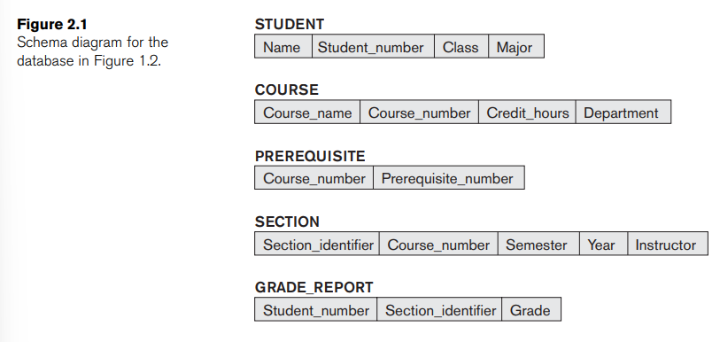
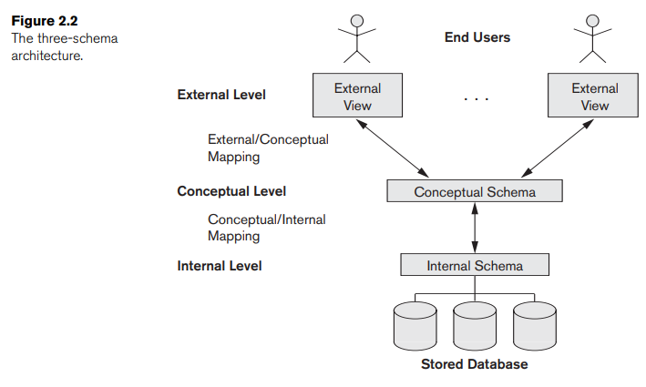

# CHAPTER 2. DATABASE SYSTEM CONCEPTS AND ARCHITECTURE 

### Introduction 

- the architecture of DBMS pakages has evolved from a tightly integrated system, to packages that are modular in design, with a client/server system architecture

### Data Models, Schemas, and Instances

- **data abstraction**: the suppression of details of data organization and storage, and highlighting of the essential features for an improved understanding of data
- **data model**: a collection of concepts that is used to describe the structure of a database (provides the means to achieve **data abstraction**)
  - _structure of a database_: data types, relationships, and constraints apply to the data
  - most data models also include a set of **basic operations** for specifying retrievals and updates on the database (insert, delete, modify,...)
  - **dynamic aspect** of a database application, for the database designer to specify valid user-defined operations 
- categories of data models - for each type of user, ranging from parametric users (most users) to computer specialists (who build the database)
  - **high-level** or **conceptual data models** provide concepts that are close to the way many users perceive data $\rightarrow$ **Entit-Relationship model**
    - **entity**: a real-world object or concepts (ex. an employee)
    - **attribute**: a property of interest that further describe an entity
    - **relationship**: an association among the entities
    - **object data model**: an example of a new family implementation data models that are closer to conceptual data models
- **low-level** or **physical data models** describe the detail of how data is stored on the computer storage media, typically magnetic disks
  - **access path**: a structure that makes the search for particular database recordss efficient
  - **index**: an example of an access path that allows direct access to data using an index term or keyword
- **representational data models** provide concepts that can be understood by end users but are not too far from the way data is organized in computer storage
- **database schema** or **intension**: the description of the data (different from the _database itself_)
- **schema diagram**: a displayed schema
- we call each object in the schema, such as `STUDENT` or `COURSE` a **schema construct**

- **database state** or **snapshot** or **extension** (of the schema): the data in the database at a particular moment in time / the current set of **occurences** or **instances** in the database
- _the schema is not supposed to change frequently_

### Three-Schema Architecture and Data Independence

- **three-schema architecture**: an architect for database systems, for achieving the following characteristics (listed in section 1.3)
  - use of a catalog to store the database description (schema)
  - insulation of programs and data (program-data and program-operation independence)
  - support of multiple user views
- the architecture clearly separates the users’ external level, the database’s conceptual level, and the internal storage level for designing a database
- _the three schemas are only descriptions of data, the stored data that actually exists is at the physical level only_
- in a DBMS based on the three-schema architecture, each user group refers to its own external schema. Hence, the DBMS must transform a request specified on an external schema into a request against the conceptual schema, and then into a request on the internal schema for processing over the stored database $\rightarrow$ The processes of transforming requests and results between levels are called **mappings**
  - whenever we have a multiple-level DBMS, its catalog must be expanded to include
  information on **how to map requests and data among the various levels**

- **data independence**: the capacity to change the schema at one level of a database system without having to change the schema at the next higher level
- there are 2 types of data independence
  1. **logical data independence**: the capacity to change the conceptual schema without having to change external schemas or application programs
  2. **physical data independence**: the capacity to change the internal schema without having to change the conceptual schema
- Data independence occurs because when the schema is changed at some level, the schema at the next higher level remains unchanged; only the mapping between the two levels is changed

### Database Languages and Interfaces

- **data definition language (DDL)** is used by the DBA and by database designers to define both schemas (internal and conceptual schemas)
- **storage definition language (SDL)** is used to specify the internal schema (in DBMSs where a clear separation is maintained between the conceptual and internal level)
  - _In most relational DBMSs today, there is no specific language that performs the role of SDL. Instead, the internal schema is specified by a combination of functions, parameters, and specifications related to storage_
- **view definition language (VDL)**: specify user views and their mappings to the conceptual schema (for a true three-schema architecture)
- **data manipulation language (DML)**: a language for users to manipulate the database, there are 2 types
  - **high-level** or **non-procedural**:
  - **low-level** or **procedural**: 
- _In current DBMSs, the preceding types of languages are usually not considered distinct languages; rather, a comprehensive integrated language is used that includes constructs for conceptual schema definition, view definition, and data manipulation_

### The Database System Environment

### Centralized and Client/Server Architectures for DBMSs

### Classification of Database Management Systems

### Summary 

### Review questions

### Exercies

### Questions
- [ ] what is **_object data model_**? (pg 31 of the book) 

### Linkie 
