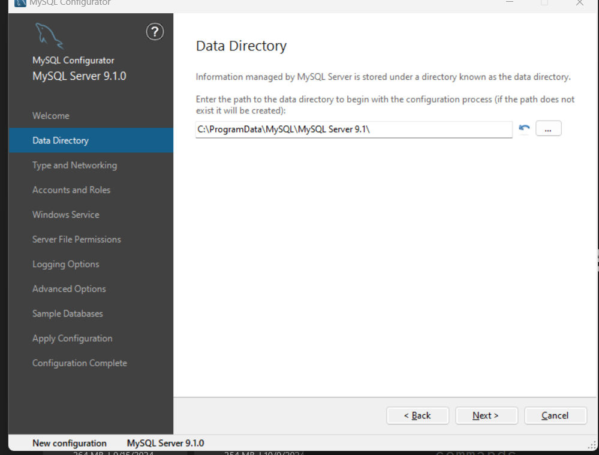
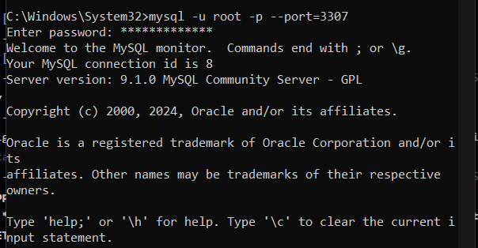

### LABS REQUIREMENTS   
- [X] install MySQL
- install using the [link](https://dev.mysql.com/downloads/mysql/)
- I installed the Windows (x86, 64-bit), MSI Installer, version 8.0.40 for Microsoft Windows
- below are my configuration steps

- [X] configurate MySQL
    ! **_before making any changes to the configuration file, you need to stop the MySQL service, using the command_** `net stop MySQL91`
    - open to the configuration file (named `my.ini`) with notepad by typing `C:\ProgramData\MySQL\MySQL Server 9.1\my.ini"` (remember to run the terminal as administrator) (if you don't know the directory of the file, you can type `dir "my.ini" /s` to find the file across the system)
  - [X] port (ex: change the port from `3306` (the default port) to `3307`)
    - after opening the file, change the line `port=3306` under the sections `[client]`, `[mysql]`, `[mysqld]` to `port=3307`
    - `Ctrl + S` to save the file 
  - [X] basedir
    - you can change it in the `my.ini` file in the same way as changing the port 
  - [ ] datadir (ex. change the datadir to `D:/MySQLData`)
    - first, open File Explorer and navigate to `C:\ProgramData\MySQL\MySQL Server 9.1\Data`, copy the entire `Data` folder, and paste it into `D:\MySQLData`
    - next, you change the `datadir` in the `my.ini` file in the same wat as changing the port, navigate to `my.ini` and change it to point to the new data directory by typing `datadir=D:/MySQLData`
    - finally, you need to update folder permissions. Right click the `D:\MySQLData` and go to **Poperties**, go to **Security** tab and ensure that **NETWORK SERVICE** or **SYSTEM** account has **Full Control** permissions. If not, cick **Edit** and grant **Full Control** to the **NETWORK SERVICE** or **SYSTEM** account
    - once the changes are made, restart the MySQL service by `net start MySQL91`

- [X] connect to MySQL server using CMD
  - by `mysql -u root -p --port=3307`
- 

- [X] some basic operations with MySQL
  - `SHOW DATABASES;` to show existing databases
  - `EXIT;` to disconnect from MySQL server 
  - `CREATE DATABASE IF NOT EXISTS database_name;` to create a database
  - `USE database_name;` to select a database that you intend to work 
  - `DROP DATABASE IF EXISTS database_name;` to delete a database
  - `SHOW VARIABLES LIKE 'datadir';` used for retrieving the **Global** and **Session** variables
  -  

### PRACTICAL EXERCISES 
- [X] how to change the default post of MySQL server to 3307 and connect to MySQL server at this port?
- [X] How to move the data directory of MySQL to another directory and reconfigure the configuration file to redirect to new data directory?
- [X] write the correct SQL statements to list all the existing databases in MySQL
- [X] write the correct SQL statements to create a new database called '_my_database_'
- [X] write the correct SQL statements to delete the database '_my_database_'
