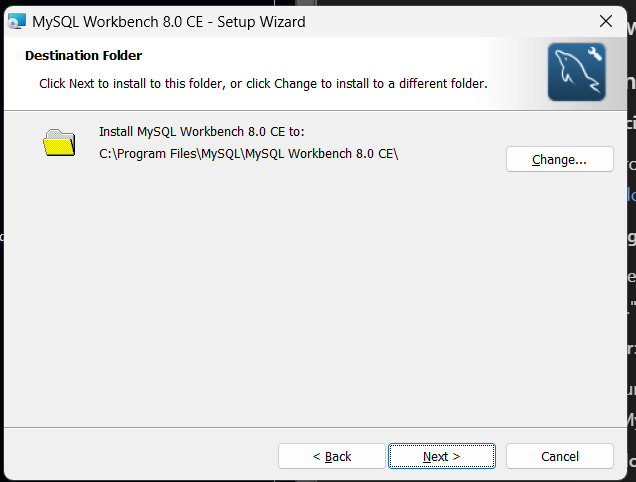
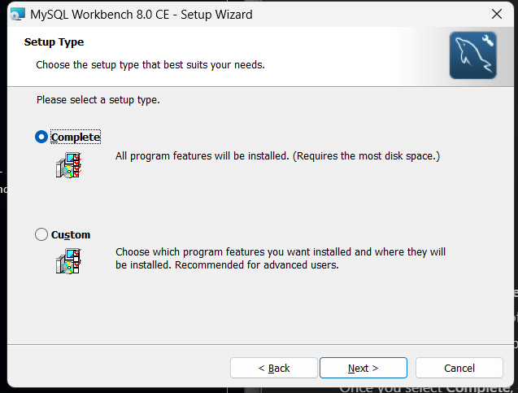
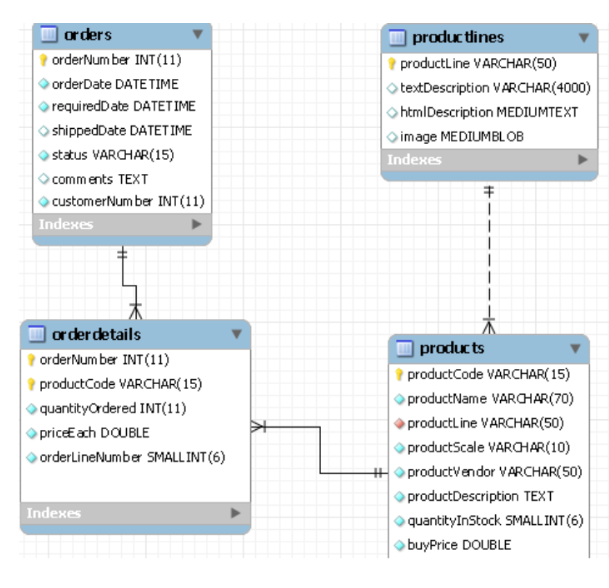

### LAB's CONTENT 

- [X] data types of MySQL
  - numeric data types
  - string data types
  - date and time data types

- [ ] create table
  - first, you need to download MySQL Workbench to work with a MySQL using a GUI
    - follow the [link](https://dev.mysql.com/downloads/workbench/) and download
    - 
    - 
  - syntax
    ```
    CREATE TABLE [IF NOT EXISTS] table_name(
        <column name><type> [<default value>] [column constraints],
        ...
        <column name><type> [<default value>] [column constraints],
        <table constraint>,
        ...
        <table constraint>
    ) type=table_type;
    ```
  - MySQL allows **default values** to be assigned to a column (`NULL`)
  - **table_type**: if not specified then MySQL will use the default table type
  - SQL constraints include: **Primary Key, Foreign Key, Not Null, Unique, Check**, which can be defined in 2 ways
    1. Column constraints: constraints are applied to a specific columnm 
    2. Table constraints: is declared separately, can apply constraints for one or more columns
  - you should **name the constraint** for easier debugging 

- [ ] alter table structure
  - to modify the table structure that already exists in the database, use the `ALTER TABLE` statement, the statement maybe used to
    - add, delete, edit columns of the table
    - add and remove constraints
  - syntax
    ```
    ALTER TABLE table_name option[,option...]
    
    OPTIONS:
        ADD [COLUMN] <column_definition>
        MODIFY [COLUMN] <create_definition>
        DROP [COLUMN] <column_name>
    
        ADD <table_constraint>
        DROP <constraint_name>
    ```

- [X] drop table
- used to delete a OR multiple tables from the database
- `DROP TABLE IF EXISTS <table_name>`

### PRACTICAL EXERCISES

- [ ] create database _My_Classimodels_
- 

- [ ] after creating the 4 data tables, add foreign key cnostraints between tables as shown in the figure 
